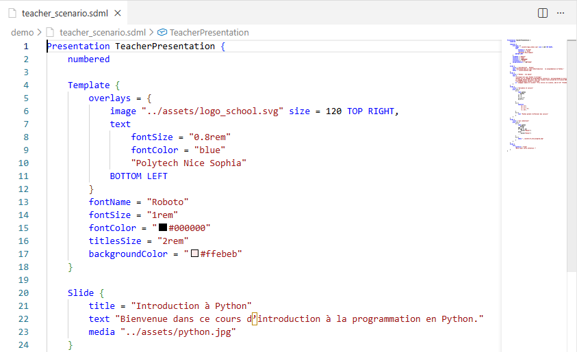
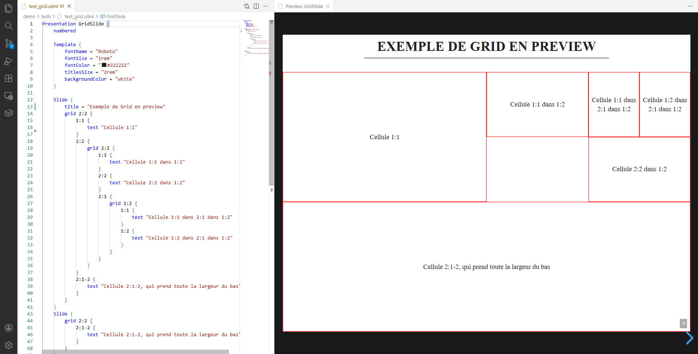
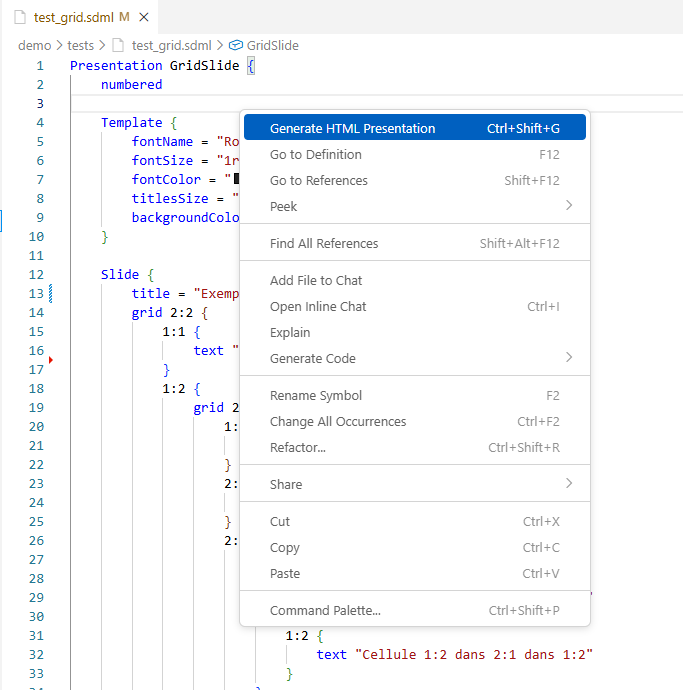
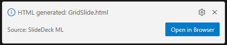
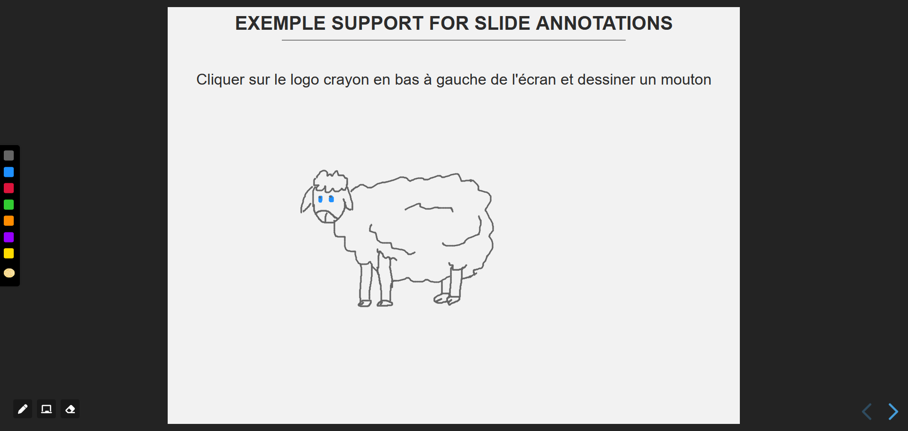
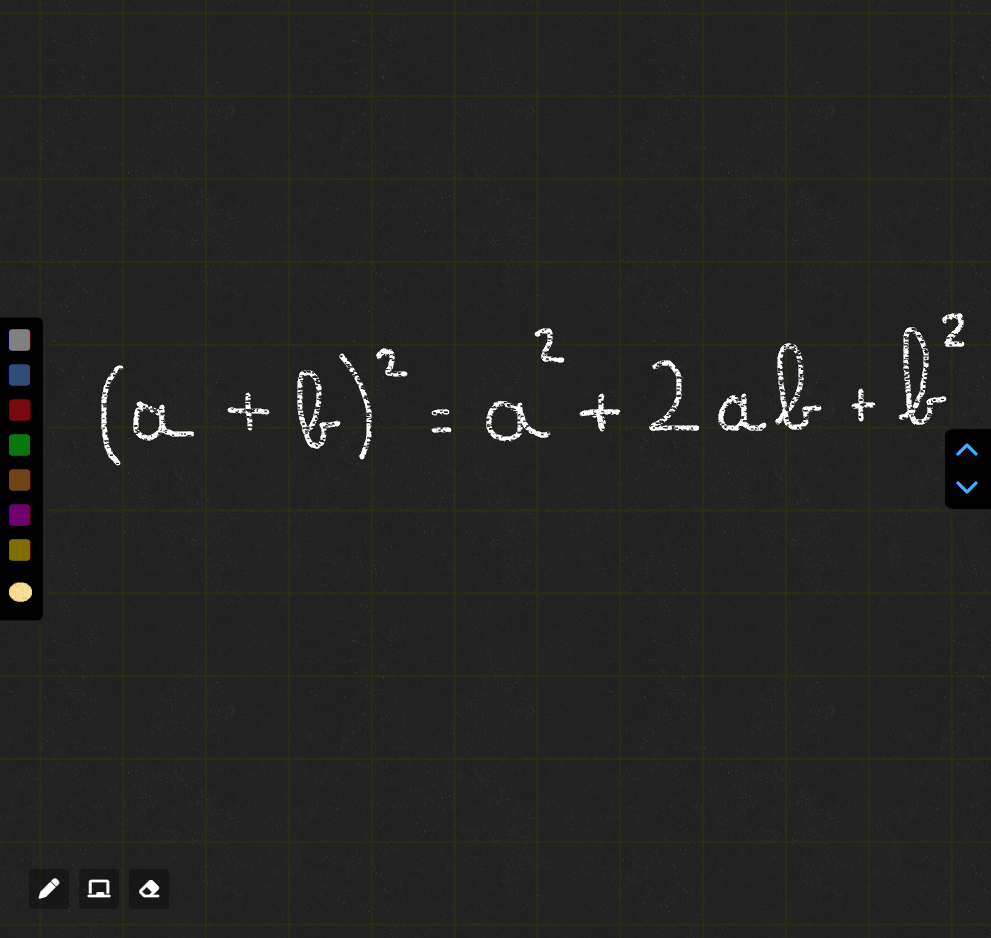

# SlideDeckML

## Équipe MJTT

**Membres :**
- Théo Lassaunière
- Thibault Ripoche
- Mathis Jullien
- Julie Seyier

## Objectif du projet

L’objectif de ce projet est de concevoir et implémenter un **langage spécifique au domaine (DSL)** nommé **SlideDeckML**, permettant de décrire des présentations de diapositives pour ensuite les générer en langages web.

À partir d’un fichier SlideDeckML (extension .sdml), le projet génère automatiquement une présentation HTML basée sur **Reveal.js**.

Le projet repose sur **Langium** pour la définition de la grammaire, l’AST, la validation et la génération.

**Exemple de rendu d'une slide :**


## Cloner le dépôt

```bash
git clone https://github.com/theoLassauniere/mjtt-SlideDeckMl.git
cd mjtt-SlideDeckMl
```

## Utilisation

Pour utiliser SlideDeckML et son extension VS Code :

```bash
npm install
npm run install:ext
```

La commande `npm run install:ext` compile le projet et installe automatiquement l'extension dans VS Code, qui fournit :
- Coloration syntaxique pour les fichiers `.sdml`
- Validation en temps réel avec messages d'erreur
- Preview interactive avec bordures de debug pour les grilles
- Génération de fichiers HTML



### Preview

La preview permet de visualiser le rendu en temps réel pendant l'édition :

- **Commande :** `SlideDeckML: Open Preview` si la preview ne s'est pas ouverte automatiquement
- **Affichage :** Panel à côté de l'éditeur, mise à jour automatique
- **Mode debug :** Bordures rouges autour des cellules d'une grille pour faciliter l'écriture de slide ne mode preview'



### Génération de fichiers HTML

Pour générer un fichier HTML final (sans bordures de debug) depuis l'extension :

**Méthode 1 - Raccourci clavier :**
- `Ctrl+Shift+G` dans un fichier `.sdml` ouvert

**Méthode 2 - Commande palette :**
1. Ouvrir un fichier `.sdml`
2. `Ctrl+Shift+P` > `SlideDeck: Generate HTML Presentation`

**Méthode 3 - Menu contextuel :**
1. Clic droit dans un fichier `.sdml`
2. Sélectionner `SlideDeck: Generate HTML Presentation`

**Fichier généré :** Le fichier HTML sera créé dans le dossier `generated/` au même niveau que votre fichier `.sdml` source.

Exemple : `demo/test.sdml` → `demo/generated/test.html`




## Développement

Pour contribuer au projet :

```bash
npm install
# Puis
npm run langium:generate # Génère le parseur depuis la grammaire
npm run build # Compile TypeScript
# ou
npm run dev # Équivalent à langium:generate + build
```

Pour le développement en mode watch :

```bash
npm run watch-dev        # Watch sur Langium, TypeScript et l'extension
```

### Génération CLI

Pour générer un fichier HTML depuis la ligne de commande :

```bash
node packages/cli/bin/cli generate <fichier.sdml>
```

Exemple :
```bash
node packages/cli/bin/cli generate demo/test.sdml
```

Le fichier HTML sera généré dans le dossier `generated/` au même niveau que le fichier source.

## Scénarios disponibles

Les scénarios de démonstration des fonctionnalités de SlideDeckML sont disponibles dans le dossier `demo/` :

- **extensions_examples.sdml** : Démonstration des fonctionnalités de nos extensions
- **student_scenario.sdml** : Scénario 1 de l'énoncé (étudiant)
- **teacher_scenario.sdml** : Scénario 2 de l'énoncé (enseignant)
- **validation_error_example.sdml** : Exemples de warnings et erreurs détectés par le validateur

## Domain Model de SlideDeckML


## Extensions

Nous avons mis en place les extensions suivantes dans notre langage :

### Support for Slide Annotations

Permet d'annoter les slides en temps réel pendant la présentation avec deux modes :

**Mode dessin** : Annotez directement sur les slides avec des outils de dessin



**Mode tableau blanc** : Utilisez un tableau blanc complet pour vos explications



### DSL Extension for Mathematical Equations

Support complet des équations mathématiques avec MathJax, permettant d'écrire des formules complexes directement dans vos slides.


